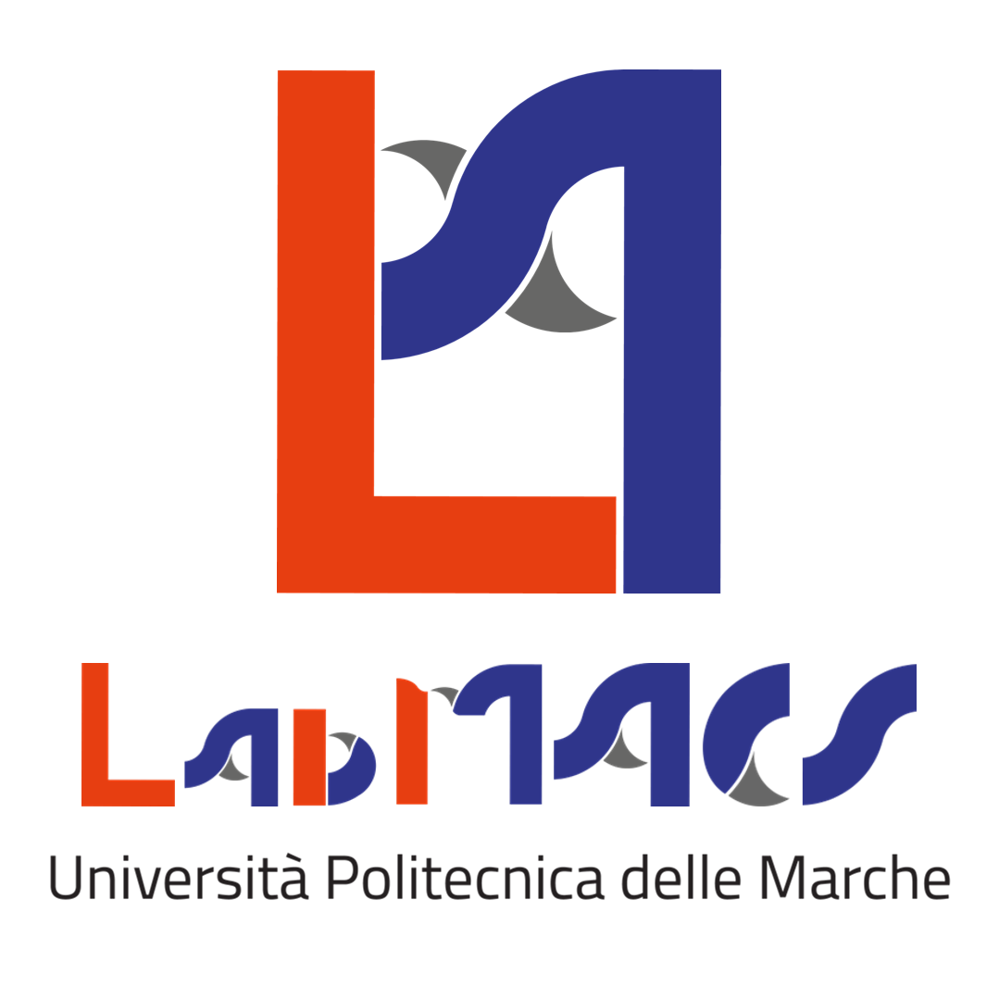
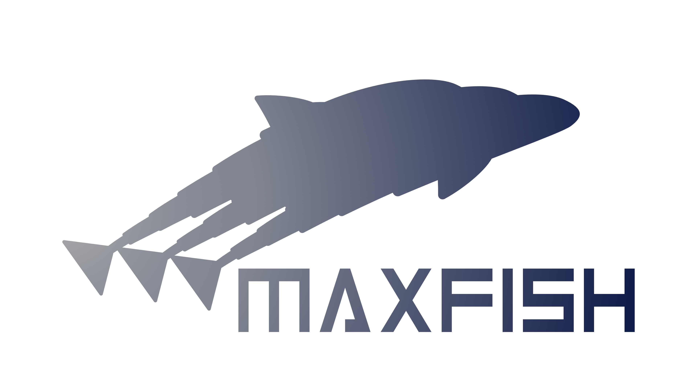

# MaxPlusPolytopic_RFSSP

Numerical example for the Robust Feedback System Synchronization Problem for max-plus linear systems with polytopic uncertainties.

  
  

## Abstract

This illustrative example, written for ScicosLab, supports the theoretical results proposed in the paper "Robust Synchronization Problems for Max-plus Linear Systems with Polytopic Uncertainties", by D. Scaradozzi, V. Bartolucci, A. M. Perdon, G. Conte, and E. Zattoni.

The paper addresses the problems of robust system synchronization for max-plus linear systems with polytopic uncertainties in all system matrices. Uncertainties in discrete event systems can arise from variations in timing constraints or processing delays. 
The work provides a methodology to tackle these problems by leveraging a geometric approach for the max-plus algebra. 
These problems aim to design a control law that ensures that the system behaves like a reference model, forcing the system's output to equal the model's output.

## Legal
**Credits**

If you have any suggestions or comments related to this software, please contact:

Veronica Bartolucci: v.bartolucci@univpm.it 

LabMACS, DII, Università Politecnica delle Marche, Via Brecce Bianche, 12, Ancona, 60131, Italy

https://www.labmacs.university/

## Funding
The work was supported by the project "MAXFISH: Multi agents systems and max-plus algebra theoretical frameworks for a robot-fish shoal modelling and control" 20225RYMJE, funded by MUR Progetti di Ricerca di Rilevante Interesse Nazionale (PRIN) Bando 2022.

## License 
[![CC BY-NC-SA 4.0][cc-by-nc-sa-shield]][cc-by-nc-sa]

This work is licensed under a
[Creative Commons Attribution-NonCommercial-ShareAlike 4.0 International License][cc-by-nc-sa].

[![CC BY-NC-SA 4.0][cc-by-nc-sa-image]][cc-by-nc-sa]

[cc-by-nc-sa]: http://creativecommons.org/licenses/by-nc-sa/4.0/
[cc-by-nc-sa-image]: https://licensebuttons.net/l/by-nc-sa/4.0/88x31.png
[cc-by-nc-sa-shield]: https://img.shields.io/badge/License-CC%20BY--NC--SA%204.0-lightgrey.svg

To acknowledge the material, the following information must be reported:
* Attribution: MAXFISH PRIN project (20225RYMJE)
             <[https://www.maxfish.it/](https://www.maxfish.it/)> 
* Title of the Work: MAXFISH RFSSP
* Source: <[https://github.com/LabMACS/MaxPlusPolytopic_RFSSP](https://github.com/LabMACS/MaxPlusPolytopic_RFSSP)>
* License information: CC BY-NC-SA 4.0

The MAXFISH RFSSP is free available.
